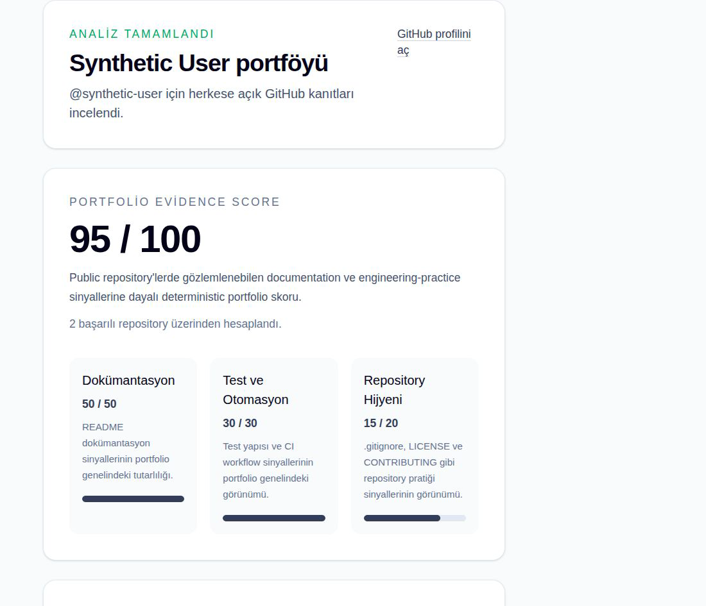
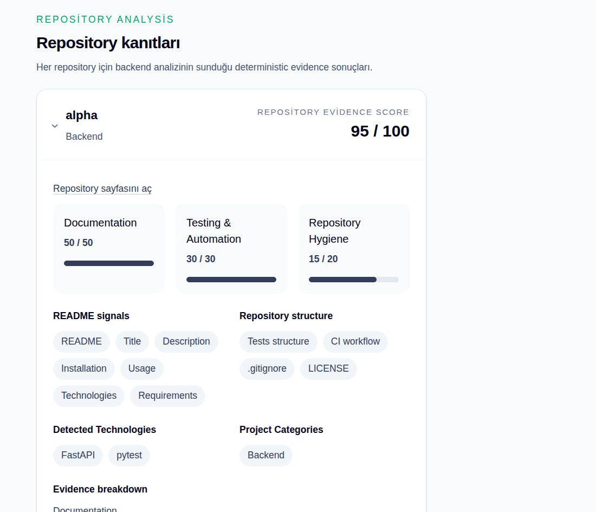

# DevLens

DevLens analyzes public GitHub portfolio signals with deterministic rules and uses Gemini to explain the structured findings and recommend a next project.

Enter a GitHub username to inspect public profile and repository evidence. DevLens returns repository-level findings, portfolio-level scoring, measurable limitations, and an optional AI interpretation. It is designed for developers and engineers who want a clearer, evidence-based view of a public portfolio.

[Live Demo](https://devlens-frontend-5hvj.onrender.com/)

## Key Features

- Public GitHub profile and repository analysis
- Evidence-backed deterministic repository and portfolio scoring
- Repository evidence for documentation, structure, technologies, and engineering practices
- Separate AI interpretation and evidence-grounded next-project recommendation
- Graceful partial success when Gemini is unavailable
- Bounded asynchronous repository analysis
- PostgreSQL-backed deterministic analysis cache

## How It Works

1. The user submits a GitHub username.
2. The backend fetches public GitHub profile, repository, tree, and selected file evidence.
3. Deterministic rules calculate repository findings and portfolio scores.
4. Compatible deterministic results can be reused through the PostgreSQL snapshot cache.
5. Structured analysis is passed to Gemini for interpretation when the optional AI layer is available.
6. The frontend renders deterministic results and the AI interpretation separately.



> Screenshots use synthetic demo data rendered through the real DevLens application pipeline.

## Deterministic Analysis vs. AI Interpretation

The deterministic layer owns repository evidence, measurable findings, repository scoring, and portfolio scoring. Gemini owns interpretation, explanation, and the next-project recommendation.

Gemini does not invent repository evidence, modify deterministic scores, or override measurable findings. Its structured response is validated against the deterministic signals, and an AI failure does not invalidate the deterministic analysis.



## Engineering and Production Highlights

- Typed GitHub API boundary with explicit timeout, upstream, not-found, and rate-limit handling
- Bounded concurrent repository analysis to keep provider work controlled
- PostgreSQL persistence and deterministic cache with analysis provenance and freshness metadata
- Structured Gemini output validation, provider-specific error taxonomy, and bounded retry
- Dockerized frontend, backend, and one-shot Alembic migration flow
- Protected GitHub Actions quality gates for backend, PostgreSQL/Alembic, frontend, and Docker
- Request IDs, structured JSON logs, provider diagnostics, and privacy-conscious outcome logging

## Production Deployment

DevLens is deployed using Render Free frontend and backend services, Neon Free PostgreSQL, the authenticated GitHub API, and Gemini 3.6 Flash Free Tier. The current deployment has an expected recurring infrastructure cost of **$0/month**; this reflects the current free-tier configuration and is not a pricing guarantee.

The production frontend is available at the [Live Demo](https://devlens-frontend-5hvj.onrender.com/). Production images use `next start` and Uvicorn, database migrations run as a separate one-shot service, and the backend exposes `GET /health` for liveness checks. Operational configuration, migration ordering, rollback guidance, and deployment boundaries are documented in [docs/production-deployment.md](docs/production-deployment.md).

## Tech Stack

- **Frontend:** Next.js 16.3.2, React 19.1, TypeScript, Tailwind CSS
- **Backend:** Python 3.12, FastAPI, Pydantic, httpx, Uvicorn
- **Data:** PostgreSQL, SQLAlchemy, asyncpg, Alembic
- **AI:** Google Gemini API; default model `gemini-3.6-flash`
- **Infrastructure:** Docker, Docker Compose, GitHub Actions, Render, Neon

## Architecture Overview

DevLens uses a direct browser → Next.js → FastAPI boundary. The backend combines public GitHub evidence with a deterministic analysis pipeline and a versioned PostgreSQL snapshot cache. Gemini receives only structured deterministic context for optional interpretation and a grounded next-project recommendation; Gemini does not determine or modify DevLens scores.



Read the full [architecture and technical story](docs/architecture.md), including the deterministic-versus-AI responsibility boundary and production request flow.

Read the [portfolio case study](docs/case-study.md) for the product problem, engineering decisions, reliability model, and technical overview.

The browser receives only the public frontend configuration. GitHub and Gemini credentials remain in the backend runtime environment.

## Testing and CI

Pull requests targeting `main` and pushes to `main` run GitHub Actions. Protected `main` requires all quality gates to pass:

- Backend regression tests and Python compilation
- PostgreSQL/Alembic migration and integration validation
- Frontend lint, type-check, production build, and high-severity production dependency audit
- Docker production-stack build, startup, health, migration, and non-root runtime smoke checks
- The aggregate `Required quality gates` check

Test counts are intentionally not hardcoded here because they change as the suite evolves. CI does not use production provider secrets or deploy the application.

## Observability

- Server-generated request IDs are returned through `X-Request-ID`.
- Application logs are emitted as structured JSON events.
- Request lifecycle, GitHub, Gemini, cache, persistence, and rate-limit diagnostics expose allowlisted operational metadata.
- Request/response bodies, prompts, provider payloads, DSNs, and secrets are not logged.

## Privacy-Conscious Instrumentation

DevLens processes GitHub username and public repository data for the analysis itself. It does not use third-party analytics SDKs, analytics cookies, persistent client analytics IDs, browser fingerprinting, IP or username analytics, click tracking, or page-view tracking. The application records only coarse server-side interpretation outcome visibility for operational product understanding; this is not a claim that the application collects no data.

## Known Limitations

- DevLens analyzes public GitHub portfolio signals only; it does not access private repositories.
- It does not measure overall developer ability, total engineering skill, hiring suitability, or job fit.
- AI interpretation is optional and depends on Gemini availability and provider limits.
- Free-tier infrastructure may make the first request slower while services wake up.
- CV matching and job recommendations are outside the V1 scope.

## Local Development

Copy the example configuration first:

```bash
cp .env.example .env
```

### Option A: Docker Compose

Docker and the Docker Compose Plugin are required. This starts a local production-like frontend, backend, PostgreSQL, and migration flow; it is not the cloud deployment.

```bash
docker compose config
docker compose build
docker compose up -d
docker compose ps
```

Open [http://localhost:3000](http://localhost:3000). The backend health endpoint is available at [http://localhost:8000/health](http://localhost:8000/health).

View logs or stop the stack:

```bash
docker compose logs -f backend frontend migrate
docker compose down
```

Compose runs `alembic upgrade head` in a separate one-shot `migrate` container after PostgreSQL becomes healthy. PostgreSQL data is stored in the `devlens-postgres-data` named volume. `docker compose down -v` removes that data.

### Option B: Manual Frontend and Backend

Frontend:

```bash
cd frontend
npm install
npm run dev
```

Backend:

```bash
cd backend
python3 -m venv .venv
source .venv/bin/activate
pip install -r requirements.txt
uvicorn app.main:app --reload --port 8000
```

With PostgreSQL available and `DATABASE_URL` configured, run migrations from `backend`:

```bash
alembic upgrade head
```

Without `DATABASE_URL`, the API can run without persistence and cache. Without `GEMINI_API_KEY`, deterministic analysis remains available and the AI result is reported as unavailable.

## Environment Configuration

See [`.env.example`](.env.example) for the local configuration template.

- **Backend runtime:** `ENVIRONMENT`, `AUTH_ENABLED`, `GITHUB_TOKEN`, `GITHUB_API_BASE_URL`, `GEMINI_API_KEY`, `GEMINI_MODEL`, `DATABASE_URL`, `CORS_ALLOWED_ORIGINS`, `FRONTEND_ORIGIN`, and `ANALYSIS_CACHE_TTL_SECONDS`. Production authentication additionally requires the complete GitHub OAuth tuple and a valid state-encryption key.
- **Frontend build-time:** `NEXT_PUBLIC_API_BASE_URL`
- **Local Compose:** `POSTGRES_DB`, `POSTGRES_USER`, and `POSTGRES_PASSWORD`

`NEXT_PUBLIC_API_BASE_URL` is browser-visible configuration embedded at frontend build time. Backend secrets must never be placed in frontend code or `NEXT_PUBLIC_*` variables. The default Gemini model is `gemini-3.6-flash`; the deterministic cache freshness default is 900 seconds.

Local examples use `ENVIRONMENT=development` and disabled authentication with localhost HTTP origins. Production must explicitly set `ENVIRONMENT=production` and `AUTH_ENABLED`; enabling authentication requires complete OAuth configuration, `DATABASE_URL`, HTTPS callback/frontend/CORS origins, and produces a Secure `__Host-devlens_session` cookie.

## API Surface

- `GET /health`
- `POST /api/v1/analysis`
- `POST /api/v1/interpretation`
