# DevLens Architecture

## Architecture Summary

DevLens separates public GitHub evidence collection, deterministic portfolio analysis, and optional AI interpretation. The browser sends a GitHub username to a Next.js frontend, which calls the FastAPI backend directly. The backend integrates with GitHub, Neon PostgreSQL, and Gemini. The deterministic engine owns evidence, scoring, findings, and limitations; Gemini receives a structured context and may explain it or recommend a bounded next project.

## Production Topology

The production frontend and backend run as separate Render services. `NEXT_PUBLIC_API_BASE_URL` is public build-time configuration; provider credentials remain backend-only. CORS restricts which frontend origins may call the API. Alembic runs as a separate one-shot migration operation before the backend rollout.

## Request and Data Flow

1. The user enters a GitHub username in the browser.
2. The browser sends a request directly to the FastAPI HTTPS endpoint.
3. FastAPI normalizes and validates the username, including the 39-character limit.
4. The backend checks for a fresh, schema-compatible, engine-compatible PostgreSQL snapshot.
5. On a cache miss, public GitHub profile and repository data are fetched.
6. Forks and archived repositories are excluded; selected repositories are analyzed with bounded concurrency.
7. README, tree, and manifest evidence produces deterministic signals and repository scores.
8. Portfolio aggregation, portfolio score, intelligence, and limitations are produced.
9. The deterministic analysis is written best-effort to PostgreSQL and can be returned by `/api/v1/analysis`.
10. `/api/v1/interpretation` builds a reduced structured context and calls Gemini when configured.
11. Gemini output is schema- and signal-reference-validated; an unavailable result does not invalidate deterministic analysis.
12. The frontend renders deterministic findings and optional AI interpretation separately.

## Deterministic Analysis Pipeline

The backend fetches a GitHub user, selects eligible repositories, and probes each repository's README, recursive tree, and selected dependency manifests. Small analyzers detect documentation, structure, technologies, and project categories. Repository scoring, portfolio aggregation, portfolio scoring, intelligence, and limitations are deterministic outputs based on observable public evidence.

Repository and portfolio scoring use version `v1`. Stars, forks, commit count, technology popularity, and category labels are not quality scores. DevLens evaluates observable public portfolio evidence, not a developer's complete ability, seniority, employability, or job fit.

## Deterministic vs AI Responsibility

| Responsibility | Deterministic Engine | Gemini |
| --- | --- | --- |
| GitHub evidence collection | Owns | Not used |
| README/tree/manifest parsing | Owns | Not used |
| Technology detection and classification | Owns | Not used |
| Repository score | Owns | Not used |
| Portfolio aggregation and score | Owns | Not used |
| Strength/improvement signals and limitations | Owns | Interprets supplied signals |
| Natural-language explanation | Not used | May explain supplied signals |
| Next-project recommendation | Supplies improvement keys | May recommend within those keys |
| Evidence creation | Must not occur | Must not occur |
| Score modification | Must not occur | Must not occur |

Gemini does not calculate, modify, or override DevLens scores. Its structured response is constrained to supplied deterministic signals, validated against their keys and order, and written in Turkish for user-facing natural language while preserving technical names and identifiers.

## PostgreSQL Snapshot Cache

Deterministic `GitHubPortfolioAnalysis` snapshots are stored in PostgreSQL JSONB through SQLAlchemy/asyncpg and Alembic-managed schema. Freshness uses `analysis_generated_at`; the current default TTL is 900 seconds. Cache reads require schema compatibility and `ANALYSIS_ENGINE_VERSION = v2`, preventing reuse of older incompatible analysis snapshots. There is no Redis layer.

The persisted row may also contain an optional interpretation payload. This is persistence, not the deterministic cache authority: when an interpretation request reuses a deterministic snapshot, Gemini may still run again. Persistence writes are best-effort, and cache read operational failures fail open where supported by the service.

## Reliability and Partial-Success Model

GitHub not-found, rate-limit, timeout, unavailable, and upstream conditions map to public API error contracts. Handled repository-analysis failures are represented as partial evidence where supported by the domain pipeline; the response preserves failure metadata and limitations. This is not an absolute guarantee that every unexpected parser or programmer error is isolated.

Gemini may be not configured, insufficiently evidenced, timed out, rate-limited, unavailable, upstream-failed, or invalid. In each supported case the API can return a stable unavailable state while retaining a successful deterministic analysis. Database cache and persistence failures are operationally best-effort, not a blanket suppression of all errors.

## Observability and Privacy

Normal application responses include a server-generated `X-Request-ID`, and a `ContextVar` correlates the request with structured JSON logs. `request.completed`, provider, cache, persistence, rate-limit, and `interpretation.completed` events expose allowlisted operational metadata. Raw unhandled 500 responses are not described as having an unconditional header guarantee.

DevLens has no third-party analytics SDK, analytics cookies, persistent client analytics ID, browser fingerprinting, or username/repository/score tracking. It records coarse server-side interpretation outcome telemetry for operational understanding. GitHub username and public repository evidence are processed for analysis; prompts, provider payloads, secrets, and DSNs are not intentionally logged.

## Key Architecture Decisions

1. **Deterministic scoring instead of LLM scoring.** Problem: LLM scores are difficult to reproduce. Decision: observable evidence owns scoring. Trade-off: less open-ended nuance, but clearer auditability.
2. **Optional constrained Gemini interpretation.** Problem: AI providers are not always available. Decision: Gemini explains a validated deterministic context only. Trade-off: an additional provider boundary, with graceful degradation.
3. **Bounded repository concurrency.** Problem: serial analysis is slow and unbounded work pressures GitHub. Decision: repository work uses a semaphore. Trade-off: controlled latency over maximum parallelism.
4. **Versioned PostgreSQL snapshot cache.** Problem: repeated GitHub work and stale results. Decision: TTL plus schema and engine compatibility gates. Trade-off: snapshot lifecycle and migration responsibility.
5. **Partial-success and best-effort persistence.** Problem: one supported upstream or database issue should not erase useful output. Decision: preserve handled failures and keep persistence optional. Trade-off: responses explicitly carry limitations and partial evidence.

## Scope and Limitations

- The system evaluates public GitHub portfolio evidence only.
- It does not measure complete developer ability, seniority, employability, or job fit.
- Stars, forks, popularity, and technology choice are not quality evidence.
- AI interpretation depends on Gemini configuration and provider availability.
- Handled partial failures can reduce available evidence.
- Cache reuse is time- and version-bounded.

## Related Documentation

- [Production deployment](production-deployment.md)
- [README](../README.md)
- [Local environment template](../.env.example)
