# DevLens — Engineering Portfolio Case Study

## Overview

DevLens analyzes public GitHub portfolios using deterministic repository evidence and produces explainable portfolio signals, with an optional AI interpretation layer (Gemini or OpenRouter). It is designed to make repository quality signals easier to inspect without presenting them as a complete measure of developer ability.

## The Problem

Reviewing a GitHub portfolio quickly is difficult: repositories contain useful evidence, but it is distributed across README files, project structure, dependency manifests, and engineering-practice files. Popularity metrics such as stars and forks are not equivalent to engineering quality. An AI-only evaluator would also make scoring less repeatable and harder to trace back to evidence.

DevLens addresses this with an evidence-first model. The technical analysis remains useful when the optional AI provider is unavailable, and the product avoids claiming to measure employability, job fit, or complete developer ability.

## Product Approach

### Deterministic Analysis

The deterministic engine owns GitHub evidence collection, README/tree/manifest parsing, technology detection, repository classification, repository scoring, portfolio aggregation, portfolio scoring, findings, and limitations. These outputs are based on observable public repository signals and are versioned for reproducibility.

### Optional AI Interpretation

The AI model receives a reduced, structured deterministic context. It may summarize patterns, explain supplied strengths and improvement areas, and recommend a bounded next project grounded in deterministic improvement signals. It cannot create evidence, invent repositories or technologies, alter scores, or override deterministic findings.

The core principle is: **deterministic evidence first, optional AI interpretation second.**

## What the System Analyzes

The portfolio score (version v3, 100 points) focuses on four deterministic dimensions:

- Documentation (40)
- Testing & Automation (25)
- Repository Hygiene (15)
- Maintenance & Visibility (20): repository description, topics and an update within the last twelve months

The recent-activity rule compares the repository's last update with the analysis time, so it is the one rule whose result changes as time passes; everything else depends only on repository evidence. Scores from older scoring versions are marked as such in the progress history and are not joined into its trend line.

The scoring model is versioned and uses repository evidence such as README sections, test structure, CI workflows, licenses, `.gitignore`, and related engineering-practice signals. Stars, forks, popularity, commit count, technology choice, and category labels are not treated as quality signals. DevLens evaluates observable public portfolio evidence, not a developer's complete ability or job fit.

## User / Request Flow

1. The user enters a GitHub username.
2. The browser calls the FastAPI backend directly over HTTPS.
3. The username is normalized and validated.
4. The backend checks for a fresh, schema-compatible PostgreSQL snapshot.
5. On a cache miss, public GitHub profile and repository data are retrieved.
6. Eligible repositories are analyzed with bounded concurrency.
7. Repository evidence becomes deterministic signals and repository scores.
8. Portfolio aggregation, scoring, findings, and limitations are produced.
9. Snapshot persistence is attempted best-effort.
10. The frontend renders deterministic results.
11. The optional interpretation endpoint may call the configured AI provider with structured deterministic context.

The full request flow and service boundaries are documented in [Architecture](architecture.md).

## Architecture

The production application is split into independently deployable frontend and backend services:

| Layer | Technology | Production |
| --- | --- | --- |
| Frontend | Next.js, React, TypeScript, Tailwind CSS | Render |
| Backend | FastAPI, Python, Pydantic, Uvicorn | Render |
| Persistence | PostgreSQL, SQLAlchemy, asyncpg, Alembic | Neon |
| External providers | GitHub API, optional AI provider (Gemini or OpenRouter) | HTTPS provider boundaries |

The browser receives only public frontend configuration. GitHub, Gemini, and database credentials remain in the backend runtime. CORS controls which frontend origins can call the backend, and database migration is a separate one-shot Alembic operation.

## Why Deterministic Scoring Instead of LLM Scoring?

Deterministic scoring provides:

- repeatable results for the same supported evidence,
- inspectable rules and evidence traceability,
- provider independence for the core analysis,
- straightforward regression testing,
- consistent repository and portfolio semantics.

This also means an AI outage does not remove the deterministic analysis. AI still adds value where generative models are useful: natural-language explanation, concise pattern summaries, and grounded recommendations. The two layers are complementary responsibilities rather than competing scoring systems.

## Reliability Design

### Bounded Concurrency

Repository analysis uses limited concurrency instead of issuing unlimited GitHub requests. This controls provider pressure, keeps resource use predictable, and makes larger portfolio analysis safer.

### Partial Success

Handled repository and provider failures can be represented as partial evidence, preserving usable results and limitations where the domain pipeline supports it. This is deliberately not described as isolating every unexpected parser or programmer error.

### Best-Effort Persistence

Supported operational persistence failures do not necessarily make a completed analysis unusable. Database configuration is optional for local operation, while production is configured with persistent PostgreSQL.

### Versioned Cache

Deterministic analysis snapshots are stored as PostgreSQL JSONB payloads. Freshness uses `analysis_generated_at` with a default TTL of 900 seconds. Schema compatibility and `ANALYSIS_ENGINE_VERSION = v3` are checked before reuse, so an old or incompatible snapshot does not silently become authoritative. There is no Redis layer. A persisted interpretation payload may exist, but interpretation is not treated as a reusable AI cache authority.

## Observability and Privacy

The backend generates request IDs, correlates them through a `ContextVar`, and emits structured JSON events for request completion, provider calls, cache, persistence, interpretation, and safe rate-limit metadata. Normal application responses include `X-Request-ID`; the documentation does not make an unconditional claim about raw unhandled 500 responses.

DevLens uses no third-party analytics SDK, analytics cookies, browser fingerprinting, persistent client analytics ID, or client analytics tracking of usernames, repositories, or scores. It records coarse server-side interpretation outcome telemetry for operational understanding. GitHub usernames and public repository evidence are processed for analysis, while prompts, provider payloads, secrets, and DSNs are not intentionally logged.

## Engineering Challenges

### Separating Scoring Authority from Generative AI

**Problem:** LLM-based scoring would weaken repeatability and evidence ownership.

**Decision:** Keep scoring deterministic and constrain the AI model to interpretation.

**Outcome:** Stable scoring semantics with optional natural-language explanation.

### Handling Many Repositories Safely

**Problem:** A portfolio can require many GitHub API calls.

**Decision:** Use bounded repository concurrency.

**Outcome:** Better provider and resource behavior without unbounded fan-out.

### Keeping the Cache Correct

**Problem:** Analysis logic changes can make old snapshots stale or incompatible.

**Decision:** Combine TTL, schema compatibility, and analysis engine version checks.

**Outcome:** Reusable cache behavior without treating every historical snapshot as authoritative.

### Graceful Degradation

**Problem:** The AI provider and persistence are external or optional dependencies.

**Decision:** Keep deterministic analysis independent from optional interpretation and use supported fail-open/best-effort behavior.

**Outcome:** Core analysis remains useful across more failure states.

### Aligning Production Documentation with Reality

**Problem:** Deployment documentation can drift from the deployed system.

**Decision:** Document the actual Render frontend, Render backend, Neon PostgreSQL, and one-shot migration topology.

**Outcome:** Architecture and operational documentation describe the same production system.

## Production Deployment

The current deployment uses:

- Render Free Next.js frontend
- Render Free FastAPI backend
- Neon Free PostgreSQL
- one-shot Alembic migration
- explicit production CORS configuration
- backend-only GitHub and AI provider credentials
- `GET /health` liveness endpoint
- AI provider selected with `AI_PROVIDER`: Gemini (`gemini-3.6-flash`) or OpenRouter (`z-ai/glm-5.3-flash`, fallback `openai/gpt-6-luna`)

Infrastructure (Render Free, Neon Free, the GitHub API) has no recurring cost under the current free-tier configuration; the AI layer is the variable cost (free with Gemini's free tier, about $0.001 per interpretation with OpenRouter, capped by a credit limit and a daily call cap). None of this is guaranteed: provider pricing, quotas, free-tier policies, and usage limits can change.

See [Production Deployment](production-deployment.md) for the current operational topology, environment contract, migration order, verification, and rollback notes.

## Validation and Quality

The repository uses a protected `main` branch with required CI checks for:

- Backend
- Frontend
- PostgreSQL / Alembic
- Docker
- Required quality gates

The architecture documentation pass also validated Markdown formatting, Mermaid rendering, SVG validity and visual presentation, security/path safety, frontend linting, frontend production build, and frontend type-checking. The local backend `pytest` executable was unavailable during that docs pass, while the required backend CI check passed.

## Scope and Limitations

- Only public GitHub evidence is analyzed; private engineering work is out of scope.
- The system does not measure complete developer ability, seniority, employability, or job fit.
- Supported scoring dimensions cover observable repository documentation, testing/automation, and hygiene signals.
- Popularity metrics are not engineering-quality evidence.
- AI interpretation depends on external provider availability, credit and configuration.
- Handled partial failures can reduce available evidence.
- Cache reuse is finite and bounded by freshness and version compatibility.
- Free-tier deployment can introduce provider limits and wake-up latency.

## What This Project Demonstrates

- Full-stack Next.js and FastAPI integration
- Typed external GitHub API integration
- Deterministic analysis engine design
- Constrained LLM integration with schema and reference validation
- PostgreSQL persistence and cache design
- Async provider access and bounded concurrency
- Schema- and engine-version-aware cache semantics
- Production migration ordering
- Structured observability and privacy-aware telemetry decisions
- Dockerized services and protected-branch CI workflow
- Production deployment on Render and Neon
- Technical documentation supported by architecture diagrams

## Technology Stack

| Category | Current stack |
| --- | --- |
| Frontend | Next.js 16.3.2, React 19.1, TypeScript, Tailwind CSS |
| Backend | Python 3.12, FastAPI, Pydantic, httpx, Uvicorn |
| Database | PostgreSQL, SQLAlchemy, asyncpg |
| External APIs | GitHub API |
| AI | Gemini API (`gemini-3.6-flash`) or OpenRouter (`z-ai/glm-5.3-flash`), selectable |
| Persistence | Alembic migrations, PostgreSQL JSONB snapshots |
| Deployment | Docker, Docker Compose, Render, Neon |
| Testing / CI | pytest, ESLint, TypeScript, GitHub Actions |
| Documentation | Markdown, Mermaid, SVG |

## Links

- [Project README](../README.md)
- [Architecture](architecture.md)
- [Production Deployment](production-deployment.md)
- [Live Demo](https://devlens.barissurkit.com/)
